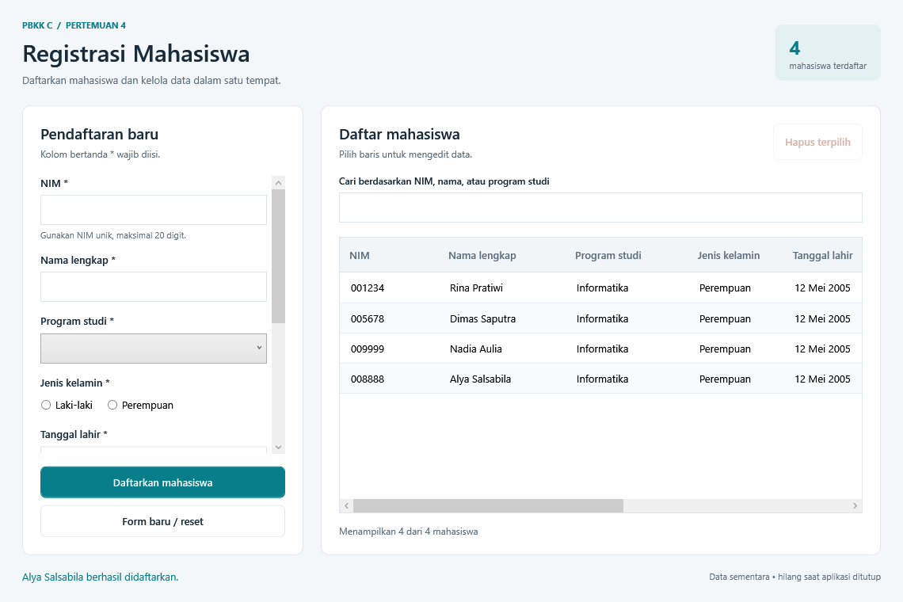

# PBKK C — Pertemuan 4: Aplikasi Registrasi Mahasiswa WPF

Aplikasi desktop registrasi mahasiswa menggunakan C#, Windows Presentation Foundation (WPF), dan **.NET Framework 4.8**. Penjelasan berbahasa Indonesia yang dapat ditempel ke Blogger tersedia di [Penjelasan-Blogger.html](Penjelasan-Blogger.html).



Pratinjau dirender dari window WPF dengan data contoh untuk dokumentasi. Untuk Blogger, unggah `Pratinjau-Aplikasi.png` melalui fitur sisipkan gambar dan gunakan URL gambar hasil unggahan pada artikel.

## Pemeriksaan tugas sebelumnya

Target framework diperiksa langsung dari file project yang ada di repository:

- Pertemuan 2, `PBKKC.Pertemuan2.csproj`: `net10.0` untuk aplikasi console.
- Pertemuan 2, `DesktopStudentManager/DesktopStudentManager.csproj`: `net10.0-windows` dan `UseWindowsForms=true`.
- Pertemuan 3, `PBKKC.Pertemuan3.csproj`: `net10.0-windows` dan `UseWindowsForms=true`.

Artinya, tugas sebelumnya menggunakan **.NET 10**, bukan .NET Framework. Pertemuan 4 dibuat dengan **.NET Framework 4.8**, sesuai permintaan saat ini. `net48` adalah target .NET Framework 4.8; `net10.0-windows` adalah target .NET 10 untuk Windows. Format project SDK-style tidak mengubah perbedaan tersebut. Source tugas lama tetap menggunakan target aslinya.

Cakupan aplikasi mengikuti permintaan aplikasi registrasi mahasiswa WPF. Tanggal pertemuan, nama dosen, dan rincian rubrik tidak ditambahkan karena belum diberikan.

## Fitur

- Form registrasi: NIM, nama lengkap, program studi, jenis kelamin, tanggal lahir, email, nomor telepon, dan alamat.
- Pilihan program studi melalui `ComboBox`, jenis kelamin melalui `RadioButton`, dan tanggal lahir melalui `DatePicker`.
- Tambah, edit, dan hapus mahasiswa; penghapusan membutuhkan konfirmasi.
- `DataGrid` menampilkan daftar mahasiswa. Memilih baris mengisi form untuk diedit.
- Reset form untuk kembali ke mode tambah.
- Pencarian berdasarkan NIM, nama, atau program studi tanpa membedakan huruf besar/kecil.
- Validasi input sebelum perubahan data disimpan.
- Daftar awal kosong. Data hanya berada di memori dan hilang saat aplikasi ditutup.

## Struktur project

```text
pertemuan-4-wpf-student-registration/
  PBKKC.Pertemuan4.sln
  PBKKC.Pertemuan4.csproj
  App.xaml
  App.xaml.cs
  MainWindow.xaml
  MainWindow.xaml.cs
  Models/
    Student.cs
  Services/
    StudentRegistration.cs
  README.md
  Penjelasan-Blogger.html
  Pratinjau-Aplikasi.png
```

- `PBKKC.Pertemuan4.csproj`: project WPF dengan `TargetFramework=net48` dan `UseWPF=true`.
- `App.xaml` dan `App.xaml.cs`: titik awal aplikasi WPF serta pengaturan aplikasi.
- `MainWindow.xaml`: susunan antarmuka, kontrol input, tombol, dan binding kolom tabel.
- `MainWindow.xaml.cs`: event tombol, pemilihan baris, pencarian, dan pembaruan tampilan.
- `Models/Student.cs`: properti data satu mahasiswa.
- `Services/StudentRegistration.cs`: validasi bersama serta pembuatan/pembaruan data mahasiswa.

## Konsep WPF yang diterapkan

XAML mendeskripsikan tampilan secara deklaratif. Kontrol disusun dalam layout WPF sehingga form dan daftar dapat menyesuaikan ukuran jendela. Code-behind C# menanggapi event pengguna, seperti klik simpan, perubahan teks pencarian, dan perubahan baris terpilih.

Daftar utama menggunakan `ObservableCollection<Student>`. Koleksi ini memberi tahu WPF ketika mahasiswa ditambahkan atau dihapus, sehingga tabel mengikuti perubahan koleksi. Kolom `DataGrid` menggunakan binding ke properti model. `ICollectionView` menyediakan tampilan daftar yang dapat difilter tanpa menghapus data dari koleksi aslinya.

Model berisi properti data mahasiswa. Saat mahasiswa diedit, aplikasi mengganti objek lama dengan objek yang telah diperbarui pada `ObservableCollection<Student>`, sehingga perubahan juga terlihat pada tabel. Implementasi ini menggunakan event di code-behind; pola MVVM belum menjadi bagian cakupan tugas.

## Validasi

- NIM wajib diisi, hanya berisi angka, maksimal 20 karakter, dan unik di antara mahasiswa yang tersimpan. NIM diperlakukan sebagai teks agar angka nol di depan tetap tersimpan.
- Nama lengkap, program studi, jenis kelamin, tanggal lahir, dan email wajib diisi. Nama maksimal 100 karakter.
- Tanggal lahir tidak boleh melewati tanggal hari ini. Jika tanggal yang diketik tidak valid, pilihan tanggal sebelumnya dikosongkan agar tanggal lama tidak ikut tersimpan tanpa sengaja.
- Email wajib memiliki format alamat email yang valid, maksimal 254 karakter, dan tanpa spasi. Pemeriksaan format tidak membuktikan bahwa alamat tersebut aktif.
- Nomor telepon opsional. Jika diisi, hanya menerima angka, spasi, tanda hubung, serta tanda `+` di awal nomor. Setelah karakter pemisah dan tanda `+` diabaikan, jumlah angka harus 6–15 digit.
- Alamat opsional dan maksimal 500 karakter.
- Input yang tidak valid ditolak sebelum koleksi mahasiswa diubah. NIM menjadi identitas tetap dan tidak dapat diubah ketika mengedit; pemeriksaan NIM saat edit mengecualikan mahasiswa yang sedang diedit.

## Menjalankan di Visual Studio

1. Gunakan Windows dan Visual Studio dengan workload **.NET desktop development** serta dukungan project SDK-style.
2. Pastikan runtime **.NET Framework 4.8** tersedia untuk menjalankan aplikasi. Project memakai package build-time `Microsoft.NETFramework.ReferenceAssemblies` versi `1.0.3` untuk menyediakan referensi .NET Framework melalui restore, sesuai [dokumentasi reference assemblies Microsoft](https://learn.microsoft.com/en-us/dotnet/framework/migration-guide/reference-assemblies). **.NET Framework 4.8 targeting pack/developer pack** dapat dipasang bila dibutuhkan oleh lingkungan Visual Studio.
3. Buka `PBKKC.Pertemuan4.sln`.
4. Pilih project `PBKKC.Pertemuan4` sebagai startup project bila diperlukan.
5. Jalankan **Build Solution**, lalu tekan **F5** atau **Ctrl+F5**.

Jika tersedia .NET SDK yang mendukung project ini, buka terminal pada folder project. Restore package referensi memerlukan akses NuGet atau cache package yang sudah tersedia; dengan package ini build tidak membutuhkan targeting pack lokal secara terpisah:

```powershell
dotnet build PBKKC.Pertemuan4.sln
```

Gunakan Visual Studio untuk menjalankan hasil build, atau buka executable yang dihasilkan di `bin/Debug/net48/`. Aplikasi WPF ini berjalan di Windows.

Build Release yang sudah dibuat pada workspace ini dapat dijalankan melalui `bin/Release/net48/PBKKC.Pertemuan4.exe`. Pertahankan file konfigurasi yang ada di folder yang sama jika menyalin executable.

## Alur penggunaan

1. Isi form registrasi dan simpan untuk menambah mahasiswa.
2. Pilih mahasiswa pada tabel untuk memuat data ke form, ubah nilai yang diperlukan, lalu simpan perubahan. NIM tetap saat edit.
3. Masukkan NIM, nama, atau program studi ke kolom pencarian untuk memfilter daftar. Kosongkan pencarian untuk menampilkan seluruh data.
4. Pilih mahasiswa lalu gunakan tombol hapus. Data dihapus setelah pengguna mengonfirmasi.
5. Gunakan reset form untuk mengosongkan input dan kembali ke mode tambah.

## Hasil verifikasi

Build Release berhasil dengan **0 warning dan 0 error**, menggunakan .NET SDK 10.0.401 sementara dan referensi .NET Framework dari NuGet. Target pada assembly hasil build diperiksa sebagai `.NETFramework,Version=v4.8`.

Sebanyak **56 pemeriksaan programatis** pada layanan validasi dan window WPF lulus. Pemeriksaan mencakup NIM unik dan nol di depan, kolom wajib, batas input, email/telepon, tanggal kosong atau tidak valid, penolakan tanggal masa depan, koreksi tanggal, registrasi, edit, pencarian, pergantian pilihan, reset setelah simpan, notifikasi koleksi, dan sesi baru yang kosong. Layout dirender pada ukuran normal dan minimum; tombol simpan tetap terlihat tanpa menggulir form. Dialog konfirmasi hapus termasuk dalam prosedur manual berikut.

## Pengujian manual

Langkah berikut merupakan daftar pemeriksaan yang dapat dilakukan saat aplikasi dijalankan, bukan pernyataan bahwa seluruh langkah telah lulus.

1. Buka aplikasi: tabel awal harus kosong.
2. Tambah mahasiswa dengan NIM `001234`, nama, program studi, jenis kelamin, tanggal lahir yang valid, dan email. Pastikan satu baris muncul dan nol di depan NIM tetap terlihat.
3. Coba simpan form kosong, NIM berhuruf, dan NIM duplikat. Masing-masing harus ditolak tanpa menambah baris. Pastikan kotak NIM membatasi input hingga 20 karakter, termasuk ketika menempel teks yang lebih panjang; layanan validasi juga menolak NIM yang melampaui batas tersebut.
4. Coba email tidak valid dan tanggal lahir di masa depan. Pilih tanggal valid lalu ketik tanggal yang tidak valid; pilihan lama harus dikosongkan dan penyimpanan harus ditolak sampai tanggal valid diisi.
5. Coba telepon berisi huruf, tanda `+` di tengah, serta nomor kurang dari 6 atau lebih dari 15 digit. Semua harus ditolak. Nomor 6–15 digit dengan `+` opsional di awal, spasi, atau tanda hubung harus diterima.
6. Pilih satu baris, edit nama/email, dan simpan. Pastikan baris yang sama berubah serta jumlah mahasiswa tetap.
7. Pilih mahasiswa untuk diedit dan pastikan NIM tidak dapat diubah. Menyimpan perubahan data lain dengan NIM yang sama harus tetap diperbolehkan.
8. Cari sebagian NIM, nama, dan program studi dengan kombinasi huruf besar/kecil. Kosongkan pencarian dan pastikan daftar lengkap kembali.
9. Batalkan dialog hapus dan pastikan data masih ada; ulangi lalu konfirmasi untuk menghapusnya.
10. Reset form setelah memilih baris, lalu tambah mahasiswa baru. Pastikan operasi berikutnya menambah data.
11. Tutup lalu buka kembali aplikasi. Tabel kembali kosong sesuai penyimpanan sementara.
12. Coba nama lebih dari 100 karakter dan alamat lebih dari 500 karakter. Pastikan batas input atau validasi mencegah penyimpanan nilai yang melebihi batas tersebut.

## Batasan

Belum ada database, penyimpanan file, autentikasi, pengiriman email, atau integrasi sistem akademik. Registrasi berarti mencatat data di dalam aplikasi selama sesi berjalan. Jika tugas resmi membutuhkan penyimpanan permanen atau aturan tambahan, cakupan tersebut perlu ditambahkan.
